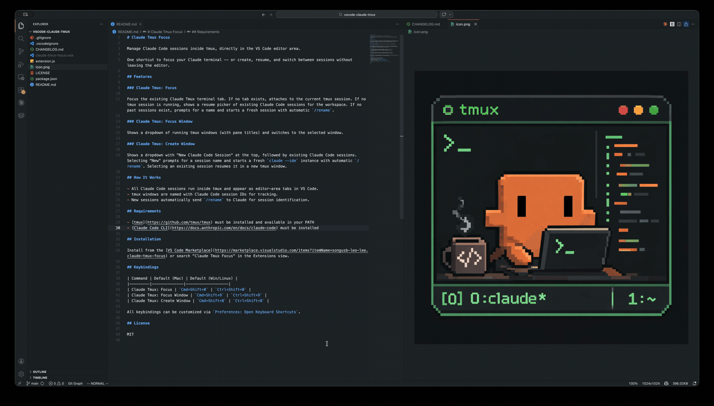
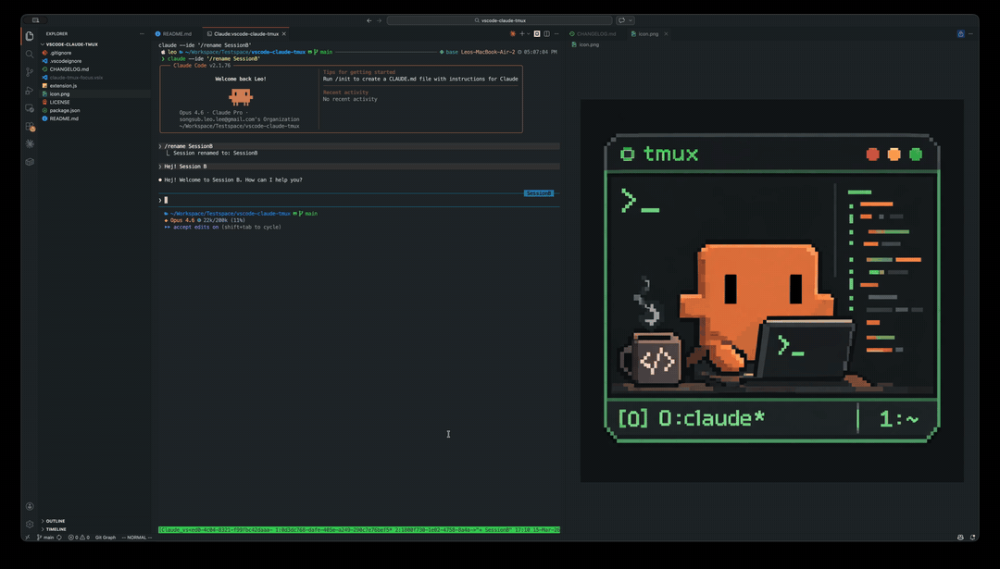
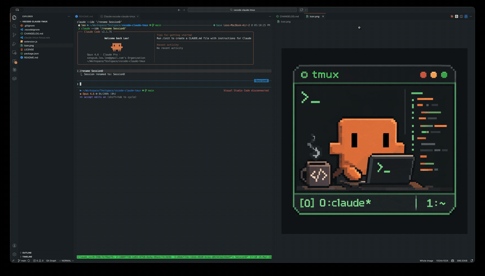

# Claude Tmux Focus

**No matter where your cursor is, one shortcut takes you straight to your Claude Code window.**

Manage Claude Code sessions inside tmux, directly in the VS Code editor area.

One shortcut to focus your Claude terminal -- or create, resume, and switch between sessions without leaving the editor.

## Features

### Claude Tmux: Focus (`Cmd+Shift+I`)

Focus the existing Claude Tmux terminal tab. If no tab exists, attaches to the current tmux session. If no tmux session is running, shows a resume picker of existing Claude Code sessions. If no past sessions exist, prompts for a name and starts a fresh session.

**No tab exists** -- creates and focuses the Claude Tmux tab:

**Tab exists but not focused** -- switches focus to the Claude Tmux tab:

### Claude Tmux: Focus on Previous / Next Session (`Cmd+Shift+,` / `Cmd+Shift+.`)

Cycle through tmux windows within the current workspace session. Wraps around at both ends.

### Claude Tmux: Focus Window

Shows a dropdown of running tmux windows (with pane titles) and switches to the selected window.

### Claude Tmux: Create New

Prompts for a session name and starts a fresh `claude --ide` instance in a new tmux window.

### Claude Tmux: Connect Claude Code Session

Browse existing Claude Code sessions and resume one in a new tmux window. If the selected session is already running, focuses the existing window instead.

### Claude Tmux: Remove

Multi-select tmux windows to remove from the session.

## How It Works

- All Claude Code sessions run inside tmux and appear as editor-area tabs in VS Code.
- tmux windows are named with Claude Code session IDs for tracking.
- New sessions automatically send `/rename` to Claude for session identification.

## Requirements

- [tmux](https://github.com/tmux/tmux) must be installed and available in your PATH
- [Claude Code CLI](https://docs.anthropic.com/en/docs/claude-code) must be installed

## Installation

Install from the [VS Code Marketplace](https://marketplace.visualstudio.com/items?itemName=songsub-leo-lee.claude-tmux-focus) or search "Claude Tmux Focus" in the Extensions view.

## Keybindings

| Command | Default (Mac) | Default (Win/Linux) |
|---------|--------------|-------------------|
| Claude Tmux: Focus | `Cmd+Shift+I` | `Ctrl+Shift+I` |
| Claude Tmux: Focus on Previous Session | `Cmd+Shift+,` | `Ctrl+Shift+,` |
| Claude Tmux: Focus on Next Session | `Cmd+Shift+.` | `Ctrl+Shift+.` |

All keybindings can be customized via `Preferences: Open Keyboard Shortcuts`.

## License

MIT
